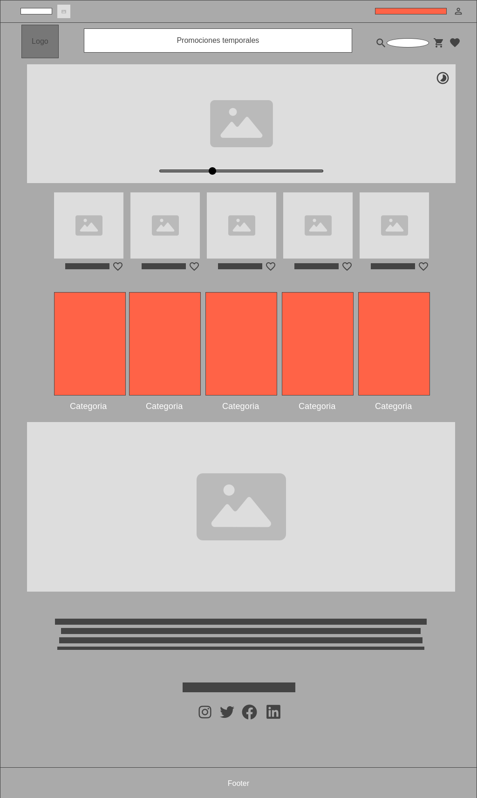
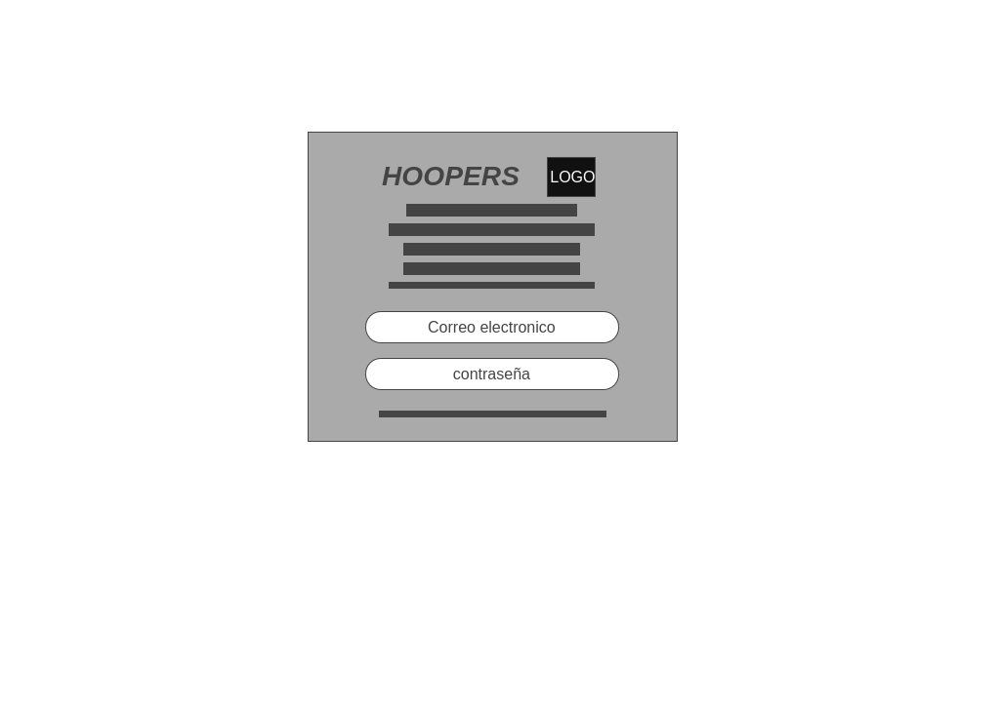
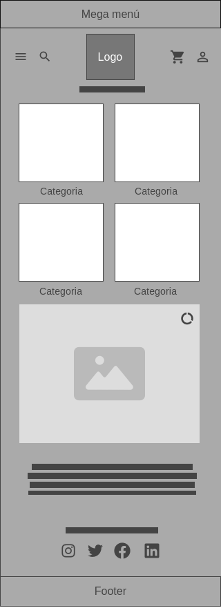

# HOOPERS

Hacer una página web de venta de productos de una marca personal. He elegido esta idea porque me parece una buena opción como primera página para ir entendiendo cómo se van haciendo las cosas. También me va a servir en un futuro para utilizarla para la marca de la que la voy a hacer.

### WEB ORDENADOR

La cosa es tener una pagina web simple con el fin de facilitar el uso y la estancia a todo tipo de clientes abarcando desde edades bastante jovenes hasta edades ya muy superiores. Para ello eh utilizado muchas imagenes para abrir secciones segun la categoria estilo o marca que estes buscando.
Y al final promocionar nuestras redes para facilitarles las nuevas promociones lanzamientos etc...

Inicio de sesion:

---

### WEB MOVIL

En la de movil he intentado hacer lo masa corta y secilla la pagina para que solo sea para entrar, buscar y comprar. Mi objetibo es mantener un orden y mostrar al cliente lo que el esta buscando sin ninguna dificultad de busqueda. Y al final promocionar nuestras redes para facilitarles las nuevas promociones lanzamientos etc...

